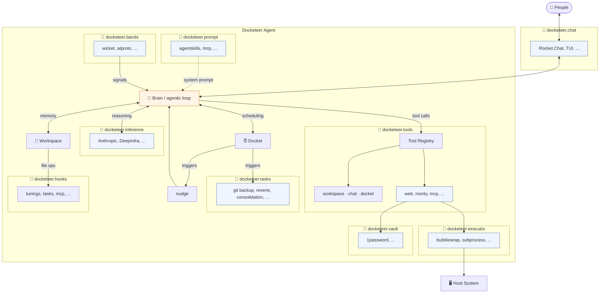

# Docketeer

Build the AI personal assistant you need with
[Docket](https://github.com/chrisguidry/docket).

## What is docketeer?

Docketeer is a _toolkit_ for building the autonomous AI agent you want without
bringing in dozens or hundreds of modules you don't. Instead of a huge and
sprawling monolithic system, Docketeer is small, opinionated, and designed to be
extended through plugins.

The core of Docketeer is an agentic loop, a Docket for scheduling autonomous
work, and a small set of tools for managing memory in its workspace. The
inference backend is pluggable — bring your own LLM provider. Any other
functionality can be added through simple Python plugins that register via
standard Python
[entry points](https://packaging.python.org/en/latest/specifications/entry-points/).

Docketeer is currently under heavy early and active development. If you're
feeling adventurous, please jump in and send PRs! Otherwise, follow along until
things are a little more baked.

## The philosophy behind Docketeer's autonomy

Our frontier models don't need much help at all to behave autonomously — they
just need an execution model to support it. All we're doing here is giving the
agent a Docket of its own, on which it can schedule its own future work. As of
today, the agent can use a tool to schedule a `nudge` Docket task to prompt
itself at any future time.

The `docketeer-autonomy` plugin builds on this with recurring `reverie` and
`consolidation` cycles that give the agent opportunities throughout the day to
evaluate the world, reflect on recent events, schedule new tasks, and update
its own memory and knowledge base. It also adds journaling, per-person
profiles, and room context — install it for the full "inner life" experience,
or leave it out for a plain chatbot.

Most importantly, the agent can direct itself by updating markdown files in its
own workspace. This self-prompting and the ability to self-improve its prompts
are the heart of Docketeer's autonomy.

## Standards

Yes, Docketeer is developed entirely with AI coding tools. Yes, every line of
Docketeer has been reviewed by me, the author. Yes, 100% test coverage is
required and enforced.

## Security

Obviously, there are inherent risks to running an autonomous agent. Docketeer
does not attempt to mitigate those risks. By using only well-aligned and
intelligent models, I'm hoping to avoid the most catastrophic outcomes
that could come from letting an agent loose on your network. However,
the largest risks are still likely to come from nefarious _human_ actors who are
eager to target these new types of autonomous AIs.

Docketeer's architecture _does not require listening to the network at all_.
There is no web interface and no API. Docketeer starts up, connects to Redis,
connects to the chat system, and _only_ responds to prompts that come from you
and the people you've allowed to interact with it via chat or from itself via
future scheduled tasks.

Prompt injection will remain a risk with any agent that can reach out to the
internet for information.

## Architecture


```mermaid
graph TD
    People(["👥 People"])
    People <--> ChatClient

    subgraph chat ["🔌 docketeer.chat"]
        ChatClient["Rocket.Chat, TUI, ..."]
    end

    ChatClient <--> Brain

    subgraph agent ["Docketeer Agent"]
        Brain["🧠 Brain / agentic loop"]

        subgraph inference ["🔌 docketeer.inference"]
            API["Anthropic, DeepInfra, ..."]
        end
        Brain <-- "reasoning" --> API
        Brain <-- "memory" --> Workspace["📂 Workspace"]
        Brain <-- "scheduling" --> Docket["⏰ Docket"]

        Docket -- triggers --> CoreTasks["nudge"]
        CoreTasks --> Brain

        subgraph prompt ["🔌 docketeer.prompt"]
            Prompts["agentskills, mcp, ..."]
        end
        Prompts -. system prompt .-> Brain

        Brain -- tool calls --> Registry
        subgraph tools ["🔌 docketeer.tools"]
            Registry["Tool Registry"]
            CoreTools["workspace · chat · docket"]
            PluginTools["web, monty, mcp, ..."]
        end
        Registry --> CoreTools
        Registry --> PluginTools

        Docket -- triggers --> PluginTasks
        subgraph tasks ["🔌 docketeer.tasks"]
            PluginTasks["git backup, reverie, consolidation, ..."]
        end

        subgraph bands ["🔌 docketeer.bands"]
            Bands["wicket, atproto, ..."]
        end
        Bands -- signals --> Brain

        subgraph hooks ["🔌 docketeer.hooks"]
            Hooks["tunings, tasks, mcp, ..."]
        end
        Workspace -- file ops --> Hooks

        subgraph executor ["🔌 docketeer.executor"]
            Sandbox["bubblewrap, subprocess, ..."]
        end
        PluginTools --> Sandbox

        subgraph vault ["🔌 docketeer.vault"]
            Secrets["1password, ..."]
        end
        PluginTools --> Secrets
    end

    Sandbox --> Host["🖥️ Host System"]

    classDef plugin fill:#f0f4ff,stroke:#4a6fa5
    classDef core fill:#fff4e6,stroke:#c77b2a
    class API,ChatClient,Prompts,PluginTools,Sandbox,Secrets,PluginTasks,Bands plugin
    class Brain core
```

### Lines

Everything the agent does happens on a **line** — a named, persistent context of
reasoning with its own conversation history. Chat conversations, scheduled tasks,
background research, and realtime event streams each run on their own lines.
Lines are just names: a DM with `chris` uses the line `chris`, a channel uses
`general`, reverie runs on `reverie`. A few more examples:

- The agent schedules a task to research an API — it runs on the line `api-research`
  and builds up context across multiple tool-use turns without cluttering any chat.
- A tuning watches GitHub webhooks for PRs across several repos — signals arrive
  on the line `opensource`, where the agent has ongoing context about each project.
- The agent notices a thread worth following up on tomorrow — it schedules a nudge
  on the line `chris` so the reply lands in the same conversation.

All lines share the same workspace. Each line can have a context file at
`lines/{name}.md` that gets loaded into the system prompt whenever that line
is active, giving the agent standing instructions for that context.

### Brain

The Brain is the agentic loop at the center of Docketeer. It receives messages
on a line, builds a system prompt, manages per-line conversation history, and
runs a multi-turn tool-use loop against the configured inference backend. Each
turn sends the conversation, system prompt blocks, and available tool definitions
to the LLM and gets back text and/or tool calls — looping until the model
responds with text or hits the tool-round limit. Everything else in the system
either feeds into the Brain or is called by it.

### Workspace

The agent's persistent filesystem — its long-term memory. Plugins can populate
it with whatever files they need; for example, the `docketeer-autonomy` plugin
writes `SOUL.md`, a daily journal, and per-person profiles here. Workspace tools
let the agent read and write its own files.

### Docket

A [Redis-backed task scheduler](https://github.com/chrisguidry/docket) that
gives the agent autonomy. The built-in `nudge` task lets the agent schedule
future prompts for itself — each scheduled task runs on its own line with
persistent conversation history. Task plugins (like `docketeer-autonomy`) can
add their own recurring tasks.

### Antenna

The realtime event feed system. Bands are persistent streaming connections to
external services — `docketeer-wicket` connects to an SSE endpoint,
`docketeer-atproto` connects to the Bluesky Jetstream WebSocket relay. Each
band produces signals: structured events with a topic, timestamp, and payload.

Tunings tell the Antenna what to listen for and where to send it. For example,
you might tune into your Wicket band filtered to `pull_request` events and
route them to the `opensource` line, where the agent already has context about
your projects. Or tune into the ATProto Jetstream filtered to mentions of your
DID and route those to a `bluesky-mentions` line. The agent can set up and
tear down tunings at runtime with `tune`, `detune`, `list_tunings`, and
`list_bands` tools — no restarts needed.

### Vault

The agent often needs secrets — API keys, tokens, passwords — to do useful work,
but those values should never appear in the conversation context where they'd be
visible in logs or could leak through tool results. The vault plugin gives the
agent five tools (`list_secrets`, `store_secret`, `generate_secret`,
`delete_secret`, `capture_secret`) that let it manage secrets by name without
ever seeing the raw values. When the agent needs a secret inside a sandboxed
command, it passes a `secret_env` mapping on `run` or `shell` and the executor
resolves the names through the vault at the last moment, injecting values as
environment variables that only the child process can see.

### Plugin extension points

All plugins are discovered via standard Python
[entry points](https://packaging.python.org/en/latest/specifications/entry-points/).
Single-plugin groups (`docketeer.inference`, `docketeer.chat`,
`docketeer.executor`, `docketeer.vault`, `docketeer.search`) auto-select when
only one is installed, or can be chosen with an environment variable when several
are available. Multi-plugin groups (`docketeer.tools`,
`docketeer.prompt`, `docketeer.tasks`, `docketeer.bands`,
`docketeer.hooks`) load everything they find.

| Entry point group | Cardinality | Purpose |
|-------------------|-------------|---------|
| `docketeer.inference` | single | Inference backend — which LLM provider powers the agent |
| `docketeer.chat` | single | Chat backend — how the agent talks to people |
| `docketeer.executor` | single, optional | Command executor — sandboxed process execution on the host |
| `docketeer.vault` | single, optional | Secrets vault — store and resolve secrets without exposing values to the agent |
| `docketeer.search` | single, optional | Search index — semantic search over workspace files |
| `docketeer.context` | multiple | Context providers — inject per-user and per-line context into conversations |
| `docketeer.tools` | multiple | Tool plugins — capabilities the agent can use during its agentic loop |
| `docketeer.prompt` | multiple | Prompt providers — contribute blocks to the system prompt |
| `docketeer.tasks` | multiple | Task plugins — background work run by the Docket scheduler |
| `docketeer.bands` | multiple | Band plugins — realtime event stream sources (SSE, WebSocket, etc.) |
| `docketeer.hooks` | multiple | Workspace hooks — react to file operations in special directories (validate, commit, delete) |

## Packages

Docketeer's git repository is a [uv workspace](https://docs.astral.sh/uv/concepts/workspaces/)
of packages endorsed by the authors, but they don't represent everything your
Docketeer agent can be! You can send new plugin implementations by PR or build
your own and install them alongside Docketeer to build your perfect agent.

| Package | PyPI | Description |
|---------|------|-------------|
| [docketeer](docketeer/) | [](https://pypi.org/project/docketeer/) | Core agent engine — workspace, scheduling, plugin discovery |
| [docketeer-1password](docketeer-1password/) | [](https://pypi.org/project/docketeer-1password/) | [1Password](https://1password.com/) secret vault — store, generate, and resolve secrets |
| [docketeer-agentskills](docketeer-agentskills/) | [](https://pypi.org/project/docketeer-agentskills/) | [Agent Skills](https://agentskills.io/specification) — install, manage, and use packaged agent expertise |
| [docketeer-anthropic](docketeer-anthropic/) | [](https://pypi.org/project/docketeer-anthropic/) | Anthropic inference backend |
| [docketeer-atproto](docketeer-atproto/) | [](https://pypi.org/project/docketeer-atproto/) | ATProto Jetstream band — realtime Bluesky events via WebSocket |
| [docketeer-autonomy](docketeer-autonomy/) | [](https://pypi.org/project/docketeer-autonomy/) | Autonomous personality — reverie, consolidation, journaling, profiles |
| [docketeer-bubblewrap](docketeer-bubblewrap/) | [](https://pypi.org/project/docketeer-bubblewrap/) | Sandboxed command execution via [bubblewrap](https://github.com/containers/bubblewrap) |
| [docketeer-deepinfra](docketeer-deepinfra/) | [](https://pypi.org/project/docketeer-deepinfra/) | [DeepInfra](https://deepinfra.com/) inference backend |
| [docketeer-git](docketeer-git/) | [](https://pypi.org/project/docketeer-git/) | Automatic git-backed workspace backups |
| [docketeer-imap](docketeer-imap/) | [](https://pypi.org/project/docketeer-imap/) | IMAP IDLE band — push-style email notifications from any IMAP server |
| [docketeer-mcp](docketeer-mcp/) | [](https://pypi.org/project/docketeer-mcp/) | [MCP](https://modelcontextprotocol.io/) server support — connect to any MCP-compatible server |
| [docketeer-monty](docketeer-monty/) | [](https://pypi.org/project/docketeer-monty/) | Sandboxed Python execution via [Monty](https://github.com/pydantic/monty) |
| [docketeer-rocketchat](docketeer-rocketchat/) | [](https://pypi.org/project/docketeer-rocketchat/) | [Rocket.Chat](https://www.rocket.chat/) chat backend |
| [docketeer-search](docketeer-search/) | [](https://pypi.org/project/docketeer-search/) | Semantic workspace search via [fastembed](https://github.com/qdrant/fastembed) |
| [docketeer-slack](docketeer-slack/) | [](https://pypi.org/project/docketeer-slack/) | [Slack](https://slack.com/) chat backend |
| [docketeer-subprocess](docketeer-subprocess/) | [](https://pypi.org/project/docketeer-subprocess/) | Unsandboxed command execution for containers and non-Linux hosts |
| [docketeer-tui](docketeer-tui/) | [](https://pypi.org/project/docketeer-tui/) | Terminal chat backend |
| [docketeer-web](docketeer-web/) | [](https://pypi.org/project/docketeer-web/) | Web search, HTTP requests, file downloads |
| [docketeer-wicket](docketeer-wicket/) | [](https://pypi.org/project/docketeer-wicket/) | Wicket SSE band — realtime events via Server-Sent Events |

Each package's README lists its tools and configuration variables.

## Getting started

```sh
git clone https://github.com/chrisguidry/docketeer.git
cd docketeer
uv sync
```

Start Redis (used by [Docket](https://github.com/chrisguidry/docket) for task
scheduling):

```sh
docker compose up -d
```

Set your inference backend's API key (and any plugin-specific variables — see
each package's README):

```sh
# For the Anthropic backend:
export DOCKETEER_ANTHROPIC_API_KEY="sk-ant-..."

# For the DeepInfra backend:
export DOCKETEER_DEEPINFRA_API_KEY="..."
```

Docketeer uses `DOCKETEER_CHAT_MODEL` (defaulting to `"balanced"`) to select a
model tier for conversations. Each backend maps tier names (`smart`, `balanced`,
`fast`) to its own model IDs, and you can override per backend with variables
like `DOCKETEER_ANTHROPIC_MODEL_SMART` or `DOCKETEER_DEEPINFRA_MODEL_BALANCED`.
Plugins may add their own model tier variables — see each package's README for
details.

Run the agent:

```sh
docketeer start
```
