# Docketeer

Build the AI personal assistant you need with
[Anthropic](https://platform.claude.com/docs/en/api/sdks/python) and
[Docket](https://github.com/chrisguidry/docket).

## What is docketeer?

Docketeer is a _toolkit_ for building the autonomous AI agent you want without
bringing in dozens or hundreds of modules you don't. Instead of a huge and
sprawling monolithic system, Docketeer is small, opinionated, and designed to be
extended through plugins.

The core of Docketeer is an agent loop based on Anthropic's client SDK, a Docket
for scheduling autonomous work, and a small set of tools for managing memory in
its workspace. Any other functionality can be added through simple Python
plugins that register via standard Python
[entry points](https://packaging.python.org/en/latest/specifications/entry-points/).

Docketeer is currently under heavy early and active development. If you're
feeling adventurous, please jump in and send PRs! Otherwise, follow along until
things are a little more baked.

## The philosophy behind Docketeer's autonomy

Our frontier models don't need much help at all to behave autonomously — they
just need an execution model to support it. All we're doing here is giving the
agent a Docket of its own, on which it can schedule its own future work. As of
today, the agent can use a tool to schedule a `nudge` Docket task to prompt
itself at any future time.

Additionally, two built-in `Perpetual` Docket tasks `reverie` and
`consolidation` give the agent recurring opportunities throughout the day to
evaluate the world, reflect on what's been going on recently, schedule new
tasks, and to update its own memory and knowledge base.

Most importantly, the agent can direct itself by updating markdown files in its
own workspace for those prompts. This self-prompting and the ability to
self-improve its prompts are the heart of Docketeer's autonomy.

## Standards

Yes, Docketeer is developed entirely with AI coding tools. Yes, every line of
Docketeer has been reviewed by me, the author. Yes, 100% test coverage is
required and enforced.

## Security

Obviously, there are inherent risks to running an autonomous agent. Docketeer
does not attempt to mitigate those risks. By using only Anthropic's extremely
well-aligned and intelligent models, I'm hoping to avoid the most catastrophic
outcomes that could come from letting an agent loose on your network. However,
the largest risks are still likely to come from nefarious _human_ actors who are
eager to target these new types of autonomous AIs.

Docketeer's architecture _does not require listening to the network at all_.
There is no web interface and no API. Docketeer starts up, connects to Redis,
connects to the chat system, and _only_ responds to prompts that come from you
and the people you've allowed to interact with it via chat or from itself via
future scheduled tasks.

Prompt injection will remain a risk with any agent that can reach out to the
internet for information.

## Architecture

```mermaid
graph TD
    People(["👥 People"])
    People <--> ChatClient

    subgraph chat ["🔌 docketeer.chat"]
        ChatClient["Rocket.Chat, ..."]
    end

    ChatClient <--> Brain

    subgraph agent ["Docketeer Agent"]
        Brain["🧠 Brain / agentic loop"]

        Brain <-- "reasoning" --> API["🤖 Claude API"]
        Brain <-- "memory" --> Workspace["📂 Workspace"]
        Brain <-- "scheduling" --> Docket["⏰ Docket"]

        Docket -- triggers --> CoreTasks["nudge · reverie · consolidation"]
        CoreTasks --> Brain

        subgraph prompt ["🔌 docketeer.prompt"]
            Prompts["agentskills, mcp, ..."]
        end
        Prompts -. system prompt .-> Brain

        Brain -- tool calls --> Registry
        subgraph tools ["🔌 docketeer.tools"]
            Registry["Tool Registry"]
            CoreTools["workspace · chat · docket"]
            PluginTools["web, monty, mcp, ..."]
        end
        Registry --> CoreTools
        Registry --> PluginTools

        Docket -- triggers --> PluginTasks
        subgraph tasks ["🔌 docketeer.tasks"]
            PluginTasks["git backup, ..."]
        end

        subgraph executor ["🔌 docketeer.executor"]
            Sandbox["bubblewrap, ..."]
        end
        PluginTools --> Sandbox
    end

    Sandbox --> Host["🖥️ Host System"]

    classDef plugin fill:#f0f4ff,stroke:#4a6fa5
    classDef core fill:#fff4e6,stroke:#c77b2a
    class ChatClient,Prompts,PluginTools,Sandbox,PluginTasks plugin
    class Brain core
```



### Brain

The Brain is the agentic loop at the center of Docketeer. It receives messages
from the chat backend, builds a system prompt, manages conversation history, and
runs a multi-turn tool-use loop against the Claude API. Each turn sends the
conversation, system prompt blocks, and available tool definitions to Claude and
gets back text and/or tool calls — looping until Claude responds with text or
hits the tool-round limit. Everything else in the system either feeds into the
Brain or is called by it.

### Workspace

The agent's persistent filesystem — its long-term memory. Contains `SOUL.md`
(the agent's personality and instructions), a daily journal, per-person profiles,
installed skills, and anything else the agent writes for itself. The Brain reads
`SOUL.md` and person context into the system prompt on every turn, and workspace
tools let the agent read and write its own files.

### Docket

A [Redis-backed task scheduler](https://github.com/chrisguidry/docket) that
gives the agent autonomy. The agent can schedule future nudges for itself, and
three built-in recurring tasks — `nudge`, `reverie`, and `consolidation` — let
it think on its own, reflect on recent events, and summarize its journal.

### Plugin extension points

All plugins are discovered via standard Python
[entry points](https://packaging.python.org/en/latest/specifications/entry-points/).
Single-plugin groups (`docketeer.chat`, `docketeer.executor`) auto-select when
only one is installed, or can be chosen with an environment variable when several
are available. Multi-plugin groups (`docketeer.tools`, `docketeer.prompt`,
`docketeer.tasks`) load everything they find.

| Entry point group | Cardinality | Purpose |
|-------------------|-------------|---------|
| `docketeer.chat` | single | Chat backend — how the agent talks to people |
| `docketeer.executor` | single, optional | Command executor — sandboxed process execution on the host |
| `docketeer.tools` | multiple | Tool plugins — capabilities the agent can use during its agentic loop |
| `docketeer.prompt` | multiple | Prompt providers — contribute blocks to the system prompt |
| `docketeer.tasks` | multiple | Task plugins — background work run by the Docket scheduler |

## Packages

Docketeer's git repository is a [uv workspace](https://docs.astral.sh/uv/concepts/workspaces/)
made up of several packages. You can send new plugin implementations by PR or
build your own and install them alongside Docketeer to build your perfect agent.

| Package | Description |
|---------|-------------|
| [docketeer](docketeer/) | Core agent engine — workspace, journal, scheduling, plugin discovery |
| [docketeer-agentskills](docketeer-agentskills/) | [Agent Skills](https://agentskills.io/specification) — install, manage, and use packaged agent expertise |
| [docketeer-bubblewrap](docketeer-bubblewrap/) | Sandboxed command execution via [bubblewrap](https://github.com/containers/bubblewrap) |
| [docketeer-git](docketeer-git/) | Automatic git-backed workspace backups |
| [docketeer-mcp](docketeer-mcp/) | [MCP](https://modelcontextprotocol.io/) server support — connect to any MCP-compatible server |
| [docketeer-monty](docketeer-monty/) | Sandboxed Python execution via [Monty](https://github.com/pydantic/monty) |
| [docketeer-rocketchat](docketeer-rocketchat/) | Rocket Chat backend for messaging |
| [docketeer-web](docketeer-web/) | Web search, HTTP requests, file downloads |

Each package's README lists its tools and configuration variables.

## Getting started

```sh
git clone https://github.com/chrisguidry/docketeer.git
cd docketeer
uv sync
```

Start Redis (used by [Docket](https://github.com/chrisguidry/docket) for task
scheduling):

```sh
docker compose up -d
```

Set your Anthropic API key (and any plugin-specific variables — see each
package's README):

```sh
export DOCKETEER_ANTHROPIC_API_KEY="sk-ant-..."
```

Run the agent:

```sh
docketeer start
```
